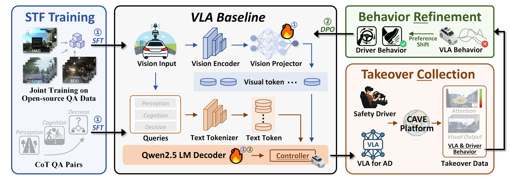

<!-- # CoReVLA: A Dual-Stage End-to-End Autonomous Driving Framework for Long-Tail Scenarios via Collect-and-Refine -->

<div align ="center">


</div>


<!-- ## Introduction -->
## Abstract 🧾
Autonomous Driving (AD) systems have made notable progress, but their performance in long-tail, safety-critical scenarios remains limited. These rare cases contribute a disproportionate number of accidents. Vision-Language Action (VLA) models have strong reasoning abilities and offer a potential solution, but their effectiveness is limited by the lack of high-quality data and inefficient learning in such conditions. To address these challenges, we propose CoReVLA, a continual learning end-to-end autonomous driving framework that improves the performance in long-tail scenarios through a dual-stage process of **data Collection and behavior Refinement**. First, the model is jointly fine-tuned on a mixture of open-source driving QA datasets, allowing it to acquire a foundational understanding of driving scenarios. Next, CoReVLA is deployed within the Cave Automatic Virtual Environment (CAVE) simulation platform, where driver takeover data is collected from real-time interactions. Each takeover indicates a long-tail scenario that CoReVLA fails to handle reliably. Finally, the model is refined via Direct Preference Optimization (DPO), allowing it to learn directly from human preferences and thereby avoid reward hacking caused by manually designed rewards. Extensive open-loop and closed-loop experiments demonstrate that the proposed CoReVLA model can accurately perceive driving scenarios and make appropriate decisions. On the Bench2Drive benchmark, CoReVLA achieves a Driving Score (DS) of 72.18 and a Success Rate (SR) of 50\%, outperforming state-of-the-art methods by 7.96 DS and 15\% SR under long-tail, safety-critical scenarios. Furthermore, case studies demonstrate the model’s ability to continually improve its performance in similar failure-prone scenarios by leveraging past takeover experiences.

---

## Highlights ✨
<div align="center">

</div>

* **HITL-based data collection in immersive simulation.** We collect visually grounded takeover data from the CAVE platform, enabling capture of failure cases in long-tail scenarios.
* **DPO-based behavior refinement.** We apply Direct Preference Optimization to efficiently align the model with human intent using sparse but high-quality takeover data.
  
---

## TODO List 🔨
- [x] Train and Eval Code 
- [x] DPO Dataset Part 1 (LingoQA)
- [x] Model Checkpoint before Refinement
- [ ] Model Checkpoint after Refinement 
- [ ] DPO Dataset Part 2 (Takeover in CAVE)

---

## Getting Started 🚀

### 1.CARLA Setup

```bash
mkdir carla && cd carla
wget https://carla-releases.s3.us-east-005.backblazeb2.com/Linux/CARLA_0.9.15.tar.gz
tar -xvf CARLA_0.9.15.tar.gz
cd Import
wget https://carla-releases.s3.us-east-005.backblazeb2.com/Linux/AdditionalMaps_0.9.15.tar.gz
cd .. && bash ImportAssets.sh
```

Set environment variables:

```bash
export CARLA_ROOT=YOUR_CARLA_PATH
echo "$CARLA_ROOT/PythonAPI/carla/dist/carla-0.9.15-py3.7-linux-x86_64.egg" >> YOUR_CONDA_PATH/envs/YOUR_CONDA_ENV_NAME/lib/python3.7/site-packages/carla.pth
```

Write `env.sh`

```bash
export CARLA_ROOT=/path/to/your/carla
export CARLA_SERVER=${CARLA_ROOT}/CarlaUE4.sh
export PYTHONPATH=$PYTHONPATH:${CARLA_ROOT}/PythonAPI:${CARLA_ROOT}/PythonAPI/carla
export PYTHONPATH=$PYTHONPATH:$CARLA_ROOT/PythonAPI/carla/dist/carla-0.9.15-py3.7-linux-x86_64.egg

export WORK_DIR=/path/to/this/repo
export PYTHONPATH=$PYTHONPATH:${WORK_DIR}/scenario_runner:${WORK_DIR}/leaderboard:${WORK_DIR}/B2DVL_Adapter

export SCENARIO_RUNNER_ROOT=${WORK_DIR}/scenario_runner
export LEADERBOARD_ROOT=${WORK_DIR}/leaderboard

export VQA_GEN=1
export STRICT_MODE=1
```

Activate Environment

```bash
source ./env.sh
```
---

### 2.Bench2Drive Setup
Detailed initialization procedures can be found in [Here](https://github.com/Thinklab-SJTU/Bench2Drive-VL).
```bash
git clone https://github.com/Thinklab-SJTU/Bench2Drive-VL
```
Replace the relevant source code files in the repository (listed in the [bench2drive_files](./bench2drive_files) folder).

### 3.Model Setup
Load the base model Qwen2.5-VL-7B-Instruct from the official Hugging Face repository:
```bash
from transformers import Qwen2_5_VLForConditionalGeneration, AutoTokenizer, AutoProcessor
from qwen_vl_utils import process_vision_info

model = Qwen2_5_VLForConditionalGeneration.from_pretrained(
    "Qwen/Qwen2.5-VL-7B-Instruct", torch_dtype="auto", device_map="auto"
)
processor = AutoProcessor.from_pretrained("Qwen/Qwen2.5-VL-7B-Instruct")
```

Merge [LoRA parameters](./checkpoint) into the Base Model with PEFT library or Llama Factory with this [YAML](./bench2drive_files/Qwen2.5-VL-7B-multiGPU-250712-all.yaml) (the latter is recommended)
```bash
from transformers import AutoTokenizer
from peft import PeftModel, PeftConfig
import torch

# Load base model
base_model_path = "./XX/"  # where you store Qwen
model = AutoModelForCausalLM.from_pretrained(base_model_path, trust_remote_code=True, torch_dtype=torch.float16)
tokenizer = AutoTokenizer.from_pretrained(base_model_path, trust_remote_code=True)

# Load and merge LoRA
lora_path = "./XX/" 
model = PeftModel.from_pretrained(model, lora_path)
model = model.merge_and_unload()

# Save the merged model (optional)
model.save_pretrained("./merged_model")
tokenizer.save_pretrained("./merged_model")
```

### 4.Run Closed-loop Test
Once the model and Bench2Drive are set up, run the following command for closed-loop testing:
```bash
bash Dev10-Qwen2.5-all.sh
```


## Data Release 📁
### STF Datasets
| Base Dataset | Instruction |      Size    |   Released  |
|:-------------:|:-----------------------:|:------------:|:----------:|
| [BDD-100k](https://bdd-data.berkeley.edu/)| Used for multi-task autonomous driving benchmarks:<br> detection, segmentation, tracking, prediction. | 100k figures with textual explanation and description | O |
| [HAD HRI](https://usa.honda-ri.com/had)  | Supports research on driver behavior, takeover intention,<br> and human-automation responsibility modeling.  | 4319 videos of 20 seconds long with textual explanation and description <br>(3926 in Train; 1123 in Val) | O |
| [LingoQA](https://github.com/wayveai/LingoQA)   | Evaluates visual-language models through question answering on images or video content. | Scenario clips with 5 seconds length and language annotations <br>(267.8k QA in Congition; 152.5 QA in Decision) | O |

Example of STF dataset format, use this code to process the original data into the corresponding format
 ```
{
    "messages": [
      {
        "role": "user",
        "content": "<image>../datasets/images/train/1074b3c991ca71badb563356dbef3d0a/0.jpg<image>../datasets/images/train/1074b3c991ca71badb563356dbef3d0a/1.jpg<image>../datasets/images/train/1074b3c991ca71badb563356dbef3d0a/2.jpg<image>../datasets/images/train/1074b3c991ca71badb563356dbef3d0a/3.jpg<image>../datasets/images/train/1074b3c991ca71badb563356dbef3d0a/4.jpg\nWhat is your current driving action and it's justification?"
      },
      {
        "role": "assistant",
        "content": "I am stopping to let the pedestrian safely cross the road ahead because it is the law and it's the right thing to do to ensure the safety of the pedestrian."
      }
    ],
    "images": [
      "../datasets/images/train/1074b3c991ca71badb563356dbef3d0a/0.jpg",
      "../datasets/images/train/1074b3c991ca71badb563356dbef3d0a/1.jpg",
      "../datasets/images/train/1074b3c991ca71badb563356dbef3d0a/2.jpg",
      "../datasets/images/train/1074b3c991ca71badb563356dbef3d0a/3.jpg",
      "../datasets/images/train/1074b3c991ca71badb563356dbef3d0a/4.jpg"
    ]
  },
 ```


### DPO Datasets
| Base Dataset | Instruction |      Size    |   Released  |
|:-------------:|:-----------------------:|:------------:|:----------:|
| [Part1](./bench2drive_files/dpo_part1.json)| Preference data from LingoQA. | 9k decision preference pairs<br> with language annotations | O |
| Part2  | Preference data from CAVE.  | Takeover data in CAVE | X |

Example of DPO dataset format
 ```
{
    "conversations": [
      {
        "from": "human",
        "value": "<image>../datasets/images/train/213b094305b36196f786e9c263a6ab89/0.jpg<image>../datasets/images/train/213b094305b36196f786e9c263a6ab89/1.jpg<image>../datasets/images/train/213b094305b36196f786e9c263a6ab89/2.jpg<image>../datasets/images/train/213b094305b36196f786e9c263a6ab89/3.jpg<image>../datasets/images/train/213b094305b36196f786e9c263a6ab89/4.jpg\nWhat are you currently doing and why?"
      }
    ],
    "images": [
      "../datasets/images/train/213b094305b36196f786e9c263a6ab89/0.jpg",
      "../datasets/images/train/213b094305b36196f786e9c263a6ab89/1.jpg",
      "../datasets/images/train/213b094305b36196f786e9c263a6ab89/2.jpg",
      "../datasets/images/train/213b094305b36196f786e9c263a6ab89/3.jpg",
      "../datasets/images/train/213b094305b36196f786e9c263a6ab89/4.jpg"
    ],
    "chosen": {
      "from": "gpt",
      "value": "I will turn to the right lane and accelerate to pass the car in front of me because there is a larger gap on the right that can provide a passing environment."
    },
    "rejected": {
      "from": "gpt",
      "value": "I will keep following the car at a steady speed because I don't know if there are any cars behind me when I turn."
    }
  },
 ```

## Disclaimer 📌
This repository is intended solely for anonymous peer review in accordance with the AAAI double-blind submission policy. The code, model checkpoints, and all associated materials are provided **for evaluation purposes only**.

They are **not officially released** and should **not be redistributed or reused** until the paper is formally accepted and the repository is migrated to a public, non-anonymous version.

All rights reserved by the authors.

 ```

## Citation
If this work is helpful for your research, please consider citing:

```

```
